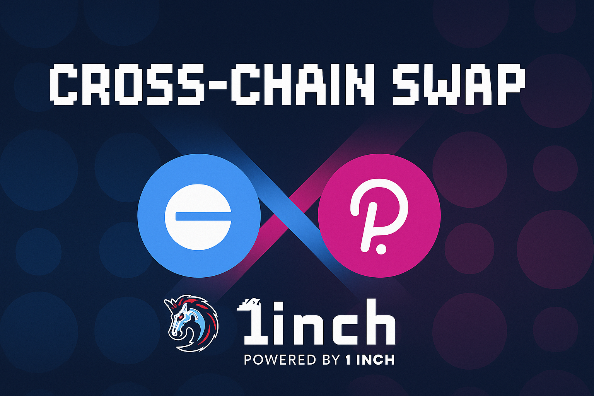

Overview

1Inch Fusion+ Swap brings a seamless cross-chain swapping experience between Base Sepolia and the Polkadot Paseo Passet Hub. By combining 1Inch Fusion+ routing logic with cross-chain settlement, the project enables users to convert assets such as USDC on Base Sepolia directly into a Polkadot native coin or any PSP22 token on Paseo.

Features & Functionality

Main features:

    Cross-chain swap routing from Base Sepolia (EVM) to Polkadot Paseo Passet Hub using 1Inch Fusion+ primitives.

    Support for example flows such as USDC on Base Sepolia -> Polkadot native coin or PSP22 tokens on Paseo.

Development Progress

We have deployed the Fusion+ swap contracts and corresponding adapters on Base Sepolia. We wrote an escrow contract and factory in Rust using ink! v6. We deployed the escrow factory on Paseo Passet Hub.

The implemented use case is the following:

- A user requests swap USDC on Base Sepolia by deploying and funding an escrow with USDC using a secret

- A resolver "picks up" on that intent and deploys an escrow on Paseo through the factory

- The escrow is funded with a custom PSP22 token by the resolver

- The secret is revealed by the user that can claim PSP22 on Paseo

- The secret is used by the resolver to claim USDC on Base Sepolia

The following features are also implemented:

- The escrow can refund PSP22 to resolver if timelock expires

- The swap can be executed from Paseo to Base Sepolia

- The swap can use native coins

- A safety deposit is provided to the escrow on Paseo and reimbursed when the resolver sends the tokens

Future Work

The following features could be implemented

-

External Links

    Home Page Link: https://1inch.io/

    Github Link: https://github.com/1inch/cross-chain-swap

    Documentation Link: https://1inch.io/assets/1inch-fusion-plus.pdf

TLDR: This machine-generated description serves as a guideline for the project and should be used to fill in and refine implementation details, links, and any team or partnership information.
